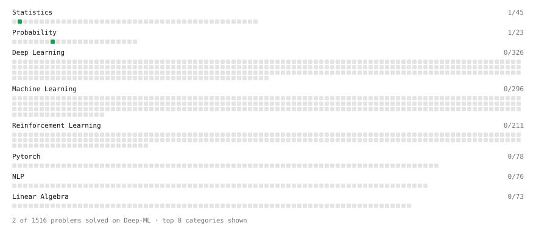

# Deep-ML

My machine learning practice from [Deep-ML](https://www.deep-ml.com). Every solution here was written by hand.

**2** solved · 2 problems · 0 labs · 0 math

[**Browse the interactive portfolio**](https://AndreiIaz.github.io/deep-ml/) to replay this filling in over time.

## Problems

| | Difficulty | Solved | |
| --- | --- | --- | --- |
| [Descriptive Statistics Calculator](https://www.deep-ml.com/problems/78) | easy | 2026-10-04 | [solution](problems/0078-descriptive-statistics-calculator) |
| [Expected Value and Variance of an n-Sided Die](https://www.deep-ml.com/problems/179) | easy | 2026-10-04 | [solution](problems/0179-expected-value-and-variance-of-an-n-sided-die) |

---

_This file is regenerated by Deep-ML on every push._
